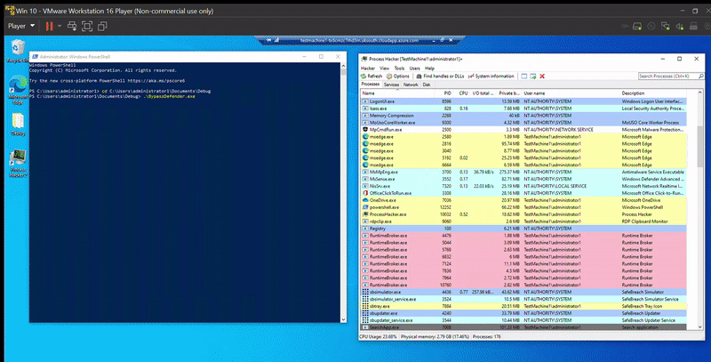

## BypassDefender

This is a C# project to make the defender process untrusted, and an attempt to stop the service using token impersonation.
Kindly use an elevated (adminsitrator) level command utility to execute.

### Methodology

This project is a quick mashup of two excellent methods to bypass defender (urls in references).

From the DefenderStop project:
```
The process first steals a token from winlogon process, and uses it to impersonate SYSTEM.
Then it spawns a TrustedInstaller process, steals that token and elevates itself again.
It also sets SeDebugPrivilege.
Finally it opens a service handle and attempts to kill the WinDefend service .
(may not always work - Access Denied error to open the service handle).
```

From the SandboxDefender project:
```
The elevated user gets a handle various Defender processes such as MsSense, MsMpEng, MpCmdRn etc.
Then, it obtains a token handle a disables a list of hardcoded privileges.
Finally, the integrity of each process is also set to untrusted.
```


### Execution

The following is an illustration of the code in action.



### References / Credits

- https://github.com/dosxuz/DefenderStop
- https://github.com/blackhatethicalhacking/SandboxDefender
